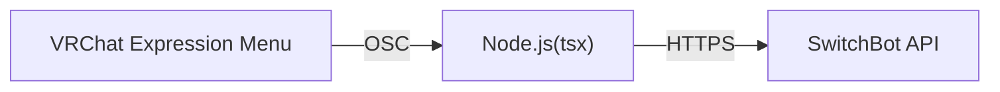

# v-suitch
VRChatでExpression MenuからSwitchBotデバイスを操作するやつ。  
V睡用にVRChat内から照明を点滅できたらいいなと思い作成。  
V睡用と言いつつSwitchBot APIを叩いているだけなので、SwitchBotでできることであれば大体は可能。



## 利用手順
1. [Node.js](https://nodejs.org)(v20以降)をインストールする
2. [pnpm](https://pnpm.io/ja)をインストールする
   ```
   npm install -g pnpm
   ```
3. 本リポジトリを任意のディレクトリにクローンする  
   [Git](https://www.git-scm.com/downloads)がインストールされていなければインストールするか、右上の`<> Code ▼`->`Download ZIP`からダウンロードして解凍する
   ```
   git clone https://github.com/conarin/v-suitch.git
   cd v-suitch
   ```
4. 依存パッケージをインストールする
   ```
   pnpm install
   ```
5. [環境変数](#環境変数)を設定する
   ```
   cp .env.sample .env
   # お好きなエディタで編集する
   ```
6. アバターのExpression Parametersに、任意の名前のパラメータをBool型で追加する  
   `Saved`にチェックを入れる
7. アバターのExpression Menuに、先ほど追加したパラメータのトグルスイッチを追加する
8. アバターをアップロード後、Expression Menuの`オプション`->`OSC`へ移動してOSCを有効にする  
   OSCが既に有効になっている場合は`設定をリセット`を押す
9. 実行する
   ```
   pnpm run start
   ```
10. Expression Menuから照明を点滅できる！

## 環境変数
| Key               | Value                                                                                                                                                                                        |
|-------------------|----------------------------------------------------------------------------------------------------------------------------------------------------------------------------------------------|
| SWITCH_BOT_TOKEN  | SwitchBotのトークン。<br/>取得方法は[公式サイト](https://support.switch-bot.com/hc/ja/articles/12822710195351-%E3%83%88%E3%83%BC%E3%82%AF%E3%83%B3%E3%81%AE%E5%8F%96%E5%BE%97%E6%96%B9%E6%B3%95)を確認。         |
| SEITCH_BOT_SECRET | SwitchBotのクライアントシークレット。<br/>取得方法は[公式サイト](https://support.switch-bot.com/hc/ja/articles/12822710195351-%E3%83%88%E3%83%BC%E3%82%AF%E3%83%B3%E3%81%AE%E5%8F%96%E5%BE%97%E6%96%B9%E6%B3%95)を確認。 |
| SLEEP_SCENE_ID    | 就寝時(パラメータが`true`のとき)に実行させるシーンのID。<br/>シーンIDは[`.fetchScenes()`](#SeitchBotクラスの使い方)メソッドで取得可能。                                                                                                  |
| WAKE_UP_SCENE_ID  | 起床時(パラメータが`false`のとき)に実行させるシーンのID。<br/>シーンIDは[`.fetchScenes()`](#SeitchBotクラスの使い方)メソッドで取得可能。                                                                                                 |
| PARAMETER_NAME    | Expression Parametersに設定したパラメータ名。                                                                                                                                                            |
| HOST              | VRChatを起動しているホスト。<br/>デフォルトは`127.0.0.1`。                                                                                                                                                     |
| IN_PORT           | OSCの受信ポート(VRChat側の送信ポート)。<br/>デフォルトは`9001`。                                                                                                                                                  |
| OUT_PORT          | OSCの送信ポート(VRChat側の受信ポート)。<br/>デフォルトは`9000`。                                                                                                                                                  |

## SeitchBotクラスの使い方
```ts
import SwitchBot from './switchBot';

const switchBot = new SwitchBot('TOKEN', 'SECRET');

// 物理デバイスと仮想デバイスの一覧を取得する
const devices = await switchBot.fetchDevices();
console.dir(devices, {depth: null});

// 物理デバイスのステータスを取得する
const deviceStatus = await switchBot.fetchDeviceStatus('deviceId');
console.dir(deviceStatus, {depth: null});

// 物理デバイスまたは仮想デバイスに制御コマンドを送信する
const commandResult = await switchBot.sendCommand('deviceId', {
    commandType: 'commandType',
    parameter: 'parameter',
    command: 'command',
});
console.dir(commandResult, {depth: null});

// シーンの一覧を取得する
const scenes = await switchBot.fetchScenes();
console.dir(scenes, {depth: null});

// シーンを実行する
const executionResult = await switchBot.executeScene('sceneId');
console.dir(executionResult, {depth: null});
```

## 備忘録
 - OSCが既に有効になっている場合、アバターを更新しても`C:\Users\<UserName>\AppData\LocalLow\VRChat\VRChat\OSC\<userId>\Avatars\<avatarId>.json`ファイルは更新されない。OSCメニューから設定をリセット、または手動で削除して生成し直す必要がある
 - 稀に`500 Internal Server Error`を返してくるので、その時はやり直す
 - ワールドを移動すると再実行される仕様ため、パラメータの`Saved`は有効にすることを推奨